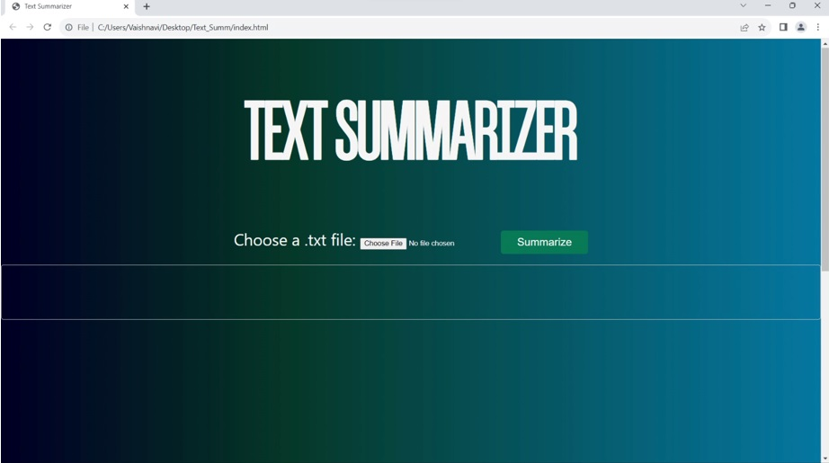
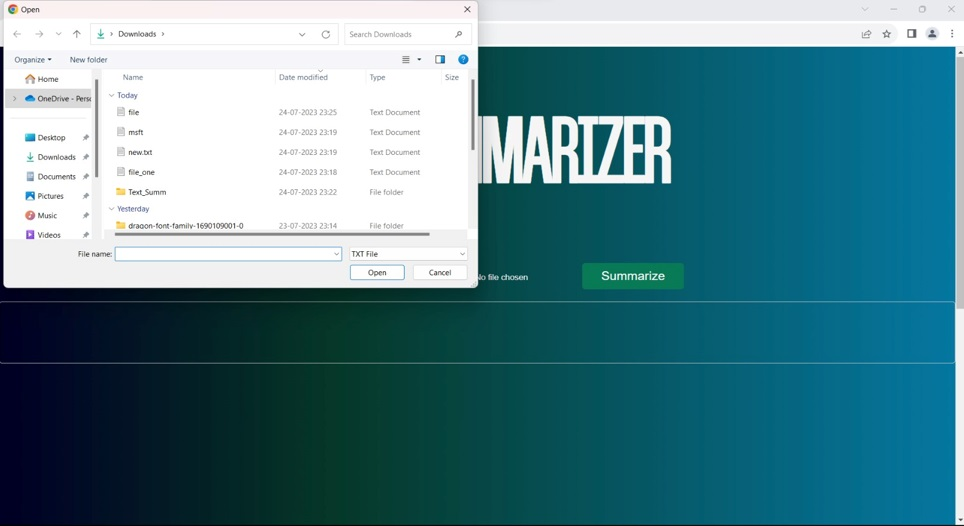
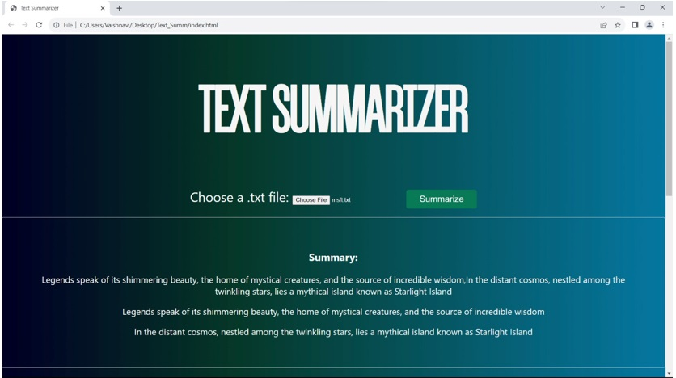

# Simple-Text-Summarizer

This is a simple web application that generates summary of the text file that is uploaded, it was developed as a part of 6th semester mini project.

# To run the code:
1.Open VS Code 
2.Run the work.py 
3.A localhost link will be  generated after that run the index.html 

# Snapshots of the working application 
  
  
  
